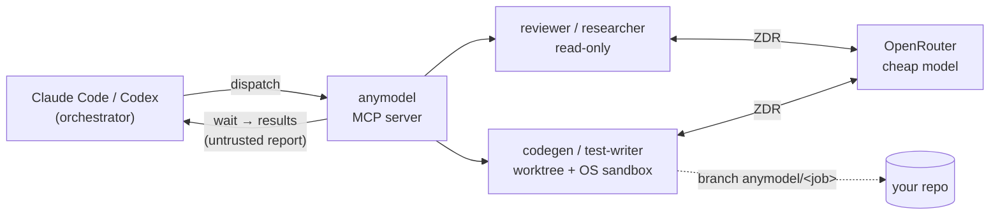

# anymodel-subagents

[](https://github.com/eschwa3/anymodel/actions/workflows/ci.yml)
[](LICENSE)

**Your Claude plans. Cheap models do the legwork.**

Subagents for Claude Code and Codex CLI that run on OpenRouter models costing
cents per million tokens. Your orchestrator writes the prompt and reads the
report; the worker does the reading, editing and testing.

**Same result on 35–54 % of the Claude usage, for ≈ $0.20–0.30 of OpenRouter
spend.** The catch: it's slower, and it doesn't pay off on small tasks.
[How we measured ↓](#numbers)


<sub>Replay of a real run (2026-09-22) with the waiting compressed; the jobs,
timings, costs and findings are the recorded ones.
[Script](docs/demo/replay.py).</sub>

## Install

**Claude Code:**

```
/plugin marketplace add eschwa3/anymodel
/plugin install anymodel-subagents@anymodel
```

Paste your OpenRouter key when prompted (it goes to your OS keychain). That's
it: the bundled `delegate` skill now routes delegation to workers, and
`/swarm <task>` fans a task out by hand (plus `/web-search` and `/web-extract`
once [web research](#web-research-optional) is on). **Codex CLI:** see
[below](#codex-cli).

Then, inside any git repository:

> Use anymodel workers: have a reviewer check this branch's diff against main
> and a researcher list every place we read environment variables. Report the
> cost.

<details>
<summary><b>Requirements</b>: macOS or Linux, <code>uv</code>, <code>git</code>, an OpenRouter key with ZDR on</summary>

- macOS or Linux. On Windows use WSL2 and keep your repos on the Linux
  filesystem (`~/…`, not `/mnt/c`).
- [uv](https://docs.astral.sh/uv/) and `git` on your `PATH`. Python is not
  needed: `uvx` brings its own (3.12+).
- Worker Bash needs an OS sandbox: built in on macOS; on Linux/WSL2
  `sudo apt install bubblewrap`. Ubuntu 24.04+ also needs
  `sudo sysctl -w kernel.apparmor_restrict_unprivileged_userns=0` (bwrap uses
  user namespaces). Without a sandbox workers still read and edit, but do not
  run commands.
- An OpenRouter key: make a **dedicated key with a credit limit**
  (openrouter.ai/keys) and switch on **Zero Data Retention**
  (openrouter.ai/settings/privacy). Without it, no request finds a provider.

</details>

## Why

- **Works like a native subagent.** Fresh context, its own tool loop, your
  repo; only the final report comes back to your orchestrator.
- **Your Claude plan stops paying for grunt work.** Reading files, grepping,
  writing tests and running them all happen on the worker's tokens.
- **Edits land on a branch, not in your tree.** The bundled editing roles
  always work in an isolated git worktree; you review the diff and merge what
  you want.
- **Commands run in an OS sandbox with no network.** macOS Seatbelt or Linux
  `bwrap`. No sandbox, no Bash.
- **Zero Data Retention on every request.** Hardcoded; nothing can turn it
  off.
- **Spend you can see and cap.** A cost ledger, per-job cost in every result,
  an optional daily budget.

## How it works



One `dispatch` per batch, one long `wait`, then `results`: status, cost,
changed files, branch and report per job. The orchestrator idles while it
waits, and idling is nearly free.

## Numbers

An orchestrator builds 16 specified features in a small Python project,
delegating all the coding; hidden tests score the result. Same score in every
run ([`bakeoff/looptest/`](bakeoff/looptest/), 2026-09-20):

| Orchestrator + who codes | Claude usage | OpenRouter | Wall time |
|---|---|---|---|
| Fable 5.1 + native Sonnet 5 subagents | 100 % | — | 6–8 min |
| Fable 5.1 + anymodel workers (glm-5.3-flash) | 35–45 % | ≈ $0.30 | 17 min |
| Sonnet 5 + anymodel workers (glm-5.3-flash) | 35–54 % | ≈ $0.20 | 16–18 min |

Usage is session-log tokens weighted into Sonnet-token units; the range covers
lead-token weights of 3–5x and cache-read weights of 0.1–0.25x. On long,
uneven jobs (2–24 min each) the orchestrator's own cost stayed flat at ≈ $3
per run.

**When it doesn't pay off.** Workers trade wall time for usage: a batch is as
slow as its slowest job. The same 16 small features, built by the orchestrator
alone, took 6 minutes and less usage than any delegating run. Delegate work
that is big, read-heavy or mechanical: diff review, codebase research, test
writing, several modules at once.

## Compared with native subagents

| | Native subagents | anymodel workers |
|---|---|---|
| Who pays for the worker's tokens | Your Claude plan | OpenRouter, cents per million tokens |
| Models | Claude | Any ZDR-capable OpenRouter model |
| Context | Fresh | Fresh |
| Edits | Your working tree by default | A branch in an isolated worktree (always, once Bash is on) |
| Shell | Claude Code's permission rules | OS sandbox, no network |
| Speed on the benchmark | 6–8 min | 16–18 min |

## Web research (optional)

Docs lookups, changelogs, CVEs, "how does library X handle Y": hand them to a
cheap `web-researcher` worker instead of spending your Claude plan on page
text. You get back a short answer with a source URL for every claim.

- **Search and read:** Brave Search finds pages, Jina Reader turns them into
  clean markdown.
- **Walled off from your code:** a web worker has no files, no shell and no
  repo. To apply what it found, your orchestrator hands the facts to a code
  worker.
- **Guard rails:** https only, no internal hosts, a per-job call cap, a
  denylist of known data-drop sites, and every page returned as untrusted
  data.

Turn it on in two steps:

1. Get a [Brave Search API](https://brave.com/search/api/) key; the Search
   plan includes $5 of free usage a month. A [Jina Reader](https://jina.ai/reader/)
   key is optional. In Claude Code, enter them under `/plugin` →
   anymodel-subagents ([Codex](docs/codex.md)).
2. Add `web_enabled: true` to your [config](#configure) and restart.

> Use a web-researcher: what changed in httpx 0.28? Cite sources.

Or directly: `/web-search <question>` for a quick cited fact, and
`/web-extract <url> <what to pull out>` to lift content from a page.

Web queries leave OpenRouter's ZDR: Brave keeps them up to 90 days for
billing, and Jina pages are fetched with do-not-track (not cached or logged).
Details: [SECURITY.md](SECURITY.md), [ADR 0001](docs/adr/0001-worker-web-access.md).

## Security

- ZDR on every request: `provider: {zdr: true, data_collection: "deny",
  require_parameters: true}`, hardcoded, nothing can turn it off.
- File tools are confined to the worker's workspace, symlinks included;
  CI configs, shell rc files and agent config are refused, lockfiles and
  `Dockerfile` are flagged.
- Bash runs only inside macOS Seatbelt or Linux `bwrap`: no network, writes
  confined to the worktree. No sandbox, no Bash.
- Worker reports come back labelled as untrusted data. No tool can change
  config or spend caps.

Threat model and reporting: [SECURITY.md](SECURITY.md). Design:
[SPEC.md](SPEC.md). Model choices come from [`bakeoff/`](bakeoff/README.md).

## Codex CLI

Codex has no plugin system; register the plain stdio MCP server:

```bash
codex mcp add anymodel -- uvx --from git+https://github.com/eschwa3/anymodel@v1.1.2 anymodel-subagents
```

Then edit the block this wrote to `~/.codex/config.toml` so the key is
forwarded by name, never written to the file:

```toml
[mcp_servers.anymodel]
command = "uvx"
args = ["--from", "git+https://github.com/eschwa3/anymodel@v1.1.2", "anymodel-subagents"]
env_vars = ["OPENROUTER_API_KEY"]
startup_timeout_sec = 60   # the first uvx start builds the environment; Codex's default is 10 s
tool_timeout_sec = 120
```

`export OPENROUTER_API_KEY=…` in the shell you launch Codex from, and paste
[`docs/AGENTS-snippet.md`](docs/AGENTS-snippet.md) into your project's
`AGENTS.md`. Codex needs `max_wait_s` below `tool_timeout_sec`, so give it its
own config file. Full setup and verified behaviour: [`docs/codex.md`](docs/codex.md).

## Configure

Optional. The file is yours; nothing in the product writes it. Restart the
client after editing.

```yaml
# ~/.config/anymodel-subagents/config.yaml
max_wait_s: 600           # Claude Code: one long wait per batch (leave 45 under Codex)
budget_per_day_usd: 5.00  # spend backstop, off by default
# timeout_s: 1800         # per-job wall clock, default 900; raise for slow test suites
# provider_sort: throughput  # fastest ZDR provider, possibly pricier; default off
# web_enabled: true       # web-researcher role; needs a Brave key (see Web research)
```

All keys, roles and the state directory: [`docs/configuration.md`](docs/configuration.md).

<details>
<summary><b>MCP tools</b></summary>

| Tool | What it does |
|---|---|
| `dispatch` | Start a batch of tasks (`role` or `model`+`mode`, `prompt`, `cwd`; optional `max_turns`, `timeout_s`). Returns job ids at once |
| `wait` | Block until the jobs finish, up to `max_wait_s`; `settle_s` returns shortly after the first completion so you merge while stragglers run |
| `results` | Status, cost, changed files, branch and report per job |
| `cancel` | Stop queued or running jobs (partial work stays on the branch) |
| `list_workers` | Roles, server info, and with `include_models=true` the ZDR-capable models and prices |
| `usage_report` | Ledger roll-up by day, model, role or swarm |

Roles ship as Markdown with native-subagent frontmatter: `reviewer` and
`researcher` (read-only), `codegen` and `test-writer` (edit+bash in a
worktree), and `web-searcher`, `web-extractor`, `web-researcher` (web only,
when enabled). Add your own in the
user config dir.

</details>

## FAQ

**Does my OpenRouter key reach the worker?** No. It stays in the MCP server's
process: never in a worker's environment, argv, transcript, job record, ledger
or error message.

**Which models do workers use?** Each role has a default picked by the
[bake-off](bakeoff/README.md): `glm-5.3-flash` for `codegen`,
`deepseek-v4.1-flash` for the rest. Pass `model` to override, or run
`list_workers` with `include_models=true` for every ZDR-capable model and its
price.

**Is my code sent anywhere?** To the OpenRouter provider serving the model,
for inference only: every request requires Zero Data Retention and denies
data collection.

**Can a worker break my repo?** The bundled editing roles (`codegen`,
`test-writer`) work on their own branch in a separate worktree. Denied paths and new symlinks are reverted before you see
the branch, and nothing merges until you do.

## License

MIT — see [LICENSE](LICENSE).
